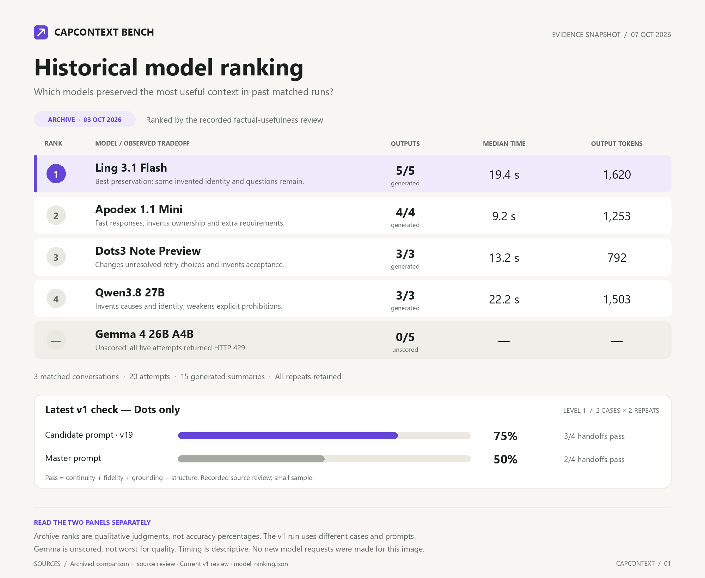

# CapContextBench v1

A small, manual benchmark for the question that matters to CapContext: **can the next assistant continue the user's pending task correctly from the delivered handoff alone?** A fluent summary with all headings can still lose a draft, grant permission that was never given, or invent work. Those are handoff failures.

Everything lives in this directory, outside `test/`. Nothing is connected to npm scripts, push hooks, GitHub Actions or production monitoring. Start a level only while working on summaries. This CLI prepares cases, creates source-review sheets and scores reviewed outputs; it never calls a model itself. Generation reuses the existing production comparison runner through the encrypted testing-key wrapper.

## Why this design

Inspired by [Cursor's account of CursorBench](https://cursor.com/blog/cursorbench): evaluate the work your product actually handles, pair tasks with evidence of correct outcomes, compare within a fixed benchmark version, and measure correctness alongside efficiency. Our adaptation measures portable conversation handoffs rather than coding patches. We use synthetic versions of observed CapContext failure patterns, not customer traffic or Cursor's dataset. These existing development fixtures are not an independent holdout; do not market their scores as production reliability.

The first principle is information sufficient for safe continuation, not similarity to one ideal prose answer. Several phrasings can be correct. Exact matching is used only for essential text that must travel verbatim. All other correctness checks need source-based semantic review, including implications, negation and scope. These reviews are a proxy for safe continuation; v1 does not measure a destination model actually completing the next task. Version 1 does not automatically judge semantics: a reviewer must record evidence for every judgment. It adds no judge API calls, and the tested model never approves its own output. The initial source audit was performed by Codex, not an independent human panel; the owner can review its judgments. The review sheet omits variant/model labels from individual entries, but this is not a fully blinded study.

## Six cases, three levels

| Level | Cases | What it isolates | Requests/model with master control |
| --- | --- | --- | --- |
| 1 — Preservation | Corrected export design; exact current newsletter draft | Current decisions, replaced choices, constraints and usable work product | 4 per repeat |
| 2 — Grounding | CSV reproduction/inspection permission; unknown testing status; review-only budget draft | Invented approvals, absent-report versus absent-work, quotations, new arithmetic and answering the pending task | 6 per repeat |
| 3 — Recall | The same current draft surrounded by 90k characters of unrelated history | Losing essential current work under context pressure; importing archive facts | 2 per repeat |

Run level 1 first, fix/review failures, then level 2 and finally level 3. One repeat is a cheap initial screen; use two complete repeats before treating a failure pattern as repeatable. All six cases with two repeats cost **24 generation requests per model**, including both prompts. Do not silently switch keys, relax privacy/free routing, retry until success, or pick the best repeat. The existing guard counts failed requests and caps each local key ledger at 50 rolling-day requests; account/provider limits may also apply.

All cases exceed the production 1,200-character tiny-carry boundary and use real generated-summary profiles. Long history keeps complete original turns and places the correction between unrelated archive blocks. Level 3 also changes the production output allowance, so a short/long difference alone cannot isolate context-window ability from profile/prompt-budget effects. We deliberately omit 280k stress, broad task coverage, online customer measurement and statistical model rankings from v1.

## What the score means

| Dimension | Pass condition | Grading |
| --- | --- | --- |
| Continuity | Latest request remains pending; essential current text/evidence lets the next assistant resume without rediscovery | Manual source review, specific evidence required |
| Fidelity | Important facts, corrections, constraints and undecided options retain their exact meaning and scope | Manual source review plus literal essential-payload checks |
| Grounding | No unsupported facts, identities, reasons, permission, activity, arithmetic or work performed during summarization | Manual source review, specific evidence required |
| Structure | Canonical boxed header; seven exact headings appear once in order; NEXT STEP is only the trusted fixed confirmation | Deterministic check on the delivered backend-processed handoff |

**Handoff pass rate** is the fraction of generated handoffs passing all four dimensions. One serious grounding failure fails that handoff even if it looks polished. Dimension pass rates identify why it failed; they are not blended into a score that lets good formatting conceal invention. The table also reports generated/planned counts, reviewed/generated counts, median elapsed generation-path milliseconds and median completion tokens. Latency includes backend processing and any local pacing; it is not pure provider inference time. Missing usage remains unavailable, not zero. Free/private routes remain enforced; tokens are an efficiency measure, not an invented monetary cost.

Unreviewed, unavailable or incomplete runs have **no final quality score**. A 429/401/404, local carry or unreached case is availability evidence, not a semantic failure or a pass. Every generated output must be reviewed, with explicit true/false judgments and evidence. No pass percentage is final unless every planned generation for that model/prompt/level exists and is reviewed. Passing a tiny set is a screening result, not a reliability guarantee.

## Manual workflow

Run from the summary-quality checkout root. Use a unique run directory so previous outputs survive. Preparation and review creation refuse to overwrite files. The underlying generation runner writes its report incrementally: always give a fresh report filename. `runs/` is ignored by Git but retained locally; deliberately attach/commit synthetic results when they inform a decision.

```powershell
# 1. Prepare only the level you are investigating (offline).
node evaluation/capcontext-bench/bench.cjs prepare --level 1 --out evaluation/capcontext-bench/runs/session-01/level1.cases.json

# 2. Generate matched master/new-prompt outputs using a dedicated encrypted key.
# Pin the actual baseline commit; use the SAME prepared file/ref/repeats for every model.
& .\scripts\compare-summary-with-test-key.ps1 -TestKey test-b -Model dots -BaselineRef a95254190755a55c09341c6626301012b1805726 -Cases evaluation/capcontext-bench/runs/session-01/level1.cases.json -Repeats 2 -Output evaluation/capcontext-bench/runs/session-01/dots.json

# 3. Create the review sheet; this makes no provider requests.
node evaluation/capcontext-bench/bench.cjs review evaluation/capcontext-bench/runs/session-01/dots.json --out evaluation/capcontext-bench/runs/session-01/dots.review.json

# Read each entry's complete source, summary and expectations. Set sourceReviewed=true.
# Set continuity/fidelity/grounding pass=true or false and cite concrete evidence.
# Leave missing judgments null; never approve them just because lexical checks pass.

# 4. Score one or several model review files in one table (offline).
node evaluation/capcontext-bench/bench.cjs score evaluation/capcontext-bench/runs/session-01/dots.review.json --out evaluation/capcontext-bench/runs/session-01/leaderboard.md
```

Change `-Model` to `ling` or `qwen` and choose the testing slot explicitly. Check availability before spending a batch: the most recent Ling runs were rate-limited and the configured Qwen alias was absent from the catalog. Do not assume that remains true forever or replace it with a paid alias. Models receive the same cases, prompt versions, production limits and rubric. The scoreboard groups matching dataset/prompt/runner/repeat cohorts and rejects different observed prompt hashes or output allowances within a cohort. A new prompt/model may form a separate comparison; never combine incompatible scores into one ranking.

Prepared case bytes, source/rubric fingerprint, input/system-prompt hashes and report hash bind the review to what was tested. Changing a source, rubric or report invalidates its review. Keep the matching Git snapshot for old benchmark runs, and bump the suite version when changing cases or criteria. Do not rewrite gold to accommodate a model's output. Harness self-checks use clearly labelled mock outputs and cannot establish model quality.

JSON file line endings are normalized for source/report fingerprints, and this directory uses LF in Git. Windows checkout conversion does not invalidate a review; escaped newline characters inside the actual conversation/output remain unchanged and are still checked.

Gold expectations and exact-payload checks are never sent to the model: the generation runner supplies only the conversation and the selected production prompt.

## Initial measured baseline

[The first level-1 Dots run](baselines/2026-10-07-dots/leaderboard.md) retains all eight generations, two repeats per prompt/case, with [source/output review evidence](baselines/2026-10-07-dots/review.json). Master passes 2/4 handoffs and the candidate 3/4 under this rubric; neither passes the whole level. Master once asserts an unlinked owner is not the user, and once omits the pending request while returning a malformed header. Candidate once calls the current draft "verified" despite no reported verification; that conservative grounding judgment is explicitly recorded for owner review. Correctly rejected historical turnout text is not counted as a current false claim, and faithful scope paraphrases are not failed solely because a lexical phrase is absent.

This is one reviewer's small development-influenced sample, not a model ranking or proof that the candidate improves production quality. Levels 2/3 and other models remain unmeasured in CapContextBench v1. The older wider comparison reports are useful historical evidence but are not silently converted into benchmark scores. The live run used eight requests on `test-b`; at completion its local rolling-day count was nine, while `test-a` remained at 35. These are local counts, not server-side remaining quotas.

## Historical model-ranking image



[The image](model-ranking.png) presents the **recorded October 3 qualitative order: Ling, Apodex, Dots, Qwen**. It comes from [the archived matched comparison](../results/2026-10-03-openrouter-primary.json) and [its factual-usefulness review](../../docs/openrouter-primary-comparison.md): three shared synthetic conversations, all 20 attempts and all 15 generated summaries. Gemma's five HTTP 429 attempts remain unscored. Counts show generated outputs, not quality passes. Timing and token medians use generated outputs only; repeats were uneven, so these are descriptive efficiency figures.

The separate lower panel shows the October 7 v1 level-1 Dots handoff pass rates. Its cases, prompts and grading differ from the archive; do not turn the qualitative ranks into accuracy percentages or combine the two panels into a current cross-model v1 ranking. This small, recorded source review does not establish production reliability or a statistically significant winner.

[model-ranking.json](model-ranking.json) records source hashes, archive result indices, medians and the reviewed v1 scores. Regenerate this dated snapshot offline from the checkout root:

```powershell
node evaluation/capcontext-bench/export-ranking.cjs
python evaluation/capcontext-bench/render-ranking.py
```

Rendering requires Pillow and Segoe UI (Windows) or DejaVu Sans. The export checks the recorded ranking and archive cohort, and validates the v1 review through the benchmark harness. Neither script makes model requests. They are manual tools with no CI or push integration. The PNG is 2000 × 1640 pixels and is marked binary in Git.

[The minimal dark plot](model-ranking-dark.png) uses the same archived data: each model has one marker for its qualitative rank and median response time. Rank is ordinal, not a percentage score; independent models are not connected into invented curves. Regenerate with `python evaluation/capcontext-bench/render-ranking-dark.py`. The original detailed image remains available.

## How to investigate a failure

The scoreboard includes per-case, per-dimension paired counts for both failing, master-only failure, candidate-only failure and both passing. Use those counts and the actual reviewer evidence together:

| Repeated observation | Supported interpretation | Next useful check |
| --- | --- | --- |
| Candidate fails while master passes on the same model/input/allowance | Candidate-specific warning; stronger with repeats | Inspect the prompt change and exact lost/invented claim |
| Same model fails both prompts; another model succeeds with those same prompts | Model-sensitive behavior | Repeat the failing dimension under the same controls before changing the prompt |
| Both prompts fail across multiple models | Common prompt, profile, task definition or grading issue is still possible | Inspect source/gold and shared instructions before declaring every model bad |
| Short case passes but its long version fails | Recall/profile pressure | Compare the exact omission and production allowance; the length change does not isolate one cause |
| Provider unavailable or review unfinished | No quality conclusion | Retain the attempt and complete an available, matched run |

Shared errors on master are evidence against blaming the new prompt alone. They do not prove a purely model-only cause. Manual grading also has uncertainty: use source/output quotes, and if a judgment is disputed leave it pending for the owner or a second reader rather than manufacturing certainty. Before production conclusions, add a few new sanitized cases from actual user handoffs and keep them separate from development cases. Do not enlarge v1 merely to increase test count.

## Check the benchmark itself

```powershell
node --test evaluation/capcontext-bench/checks.cjs
```

These eight opt-in checks use controlled mock data and no API keys/network. They verify source selection, exact text/structure loss, unreviewed/availability handling, repeat/pair accounting, review tampering and cross-model comparison controls. They test measurement integrity, not whether an LLM produces good summaries. The usual tests, CI and push behavior stay unchanged.
